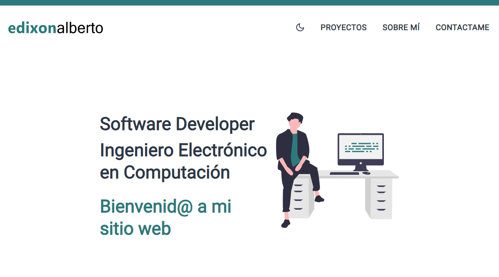

# web-edixonalberto

Personal web page to expose professional information with a blog included to create a post
about programming.

## [Go to website](http://www.edixonalberto.com) &#x279c;

### Technologies Used

- Programming Language: JavaScript
- Framework: Gridsome, Vue
- Styles: CSS3, Tailwind
- API: [api-email-sendgrid](https://github.com/EdixonAlberto/api-email-sendgrid), api
  created by me to send emails throgh of service [SendGrid](https://sendgrid.com/)
